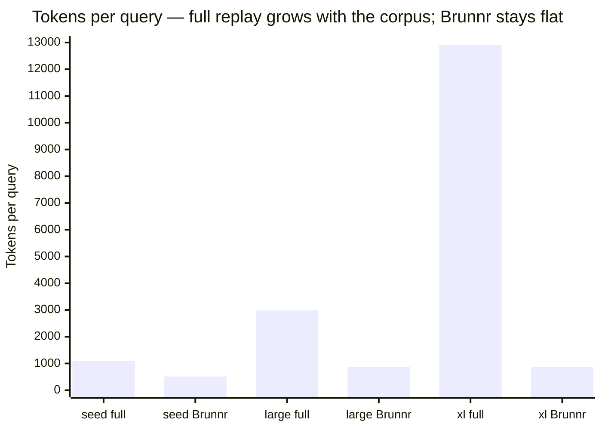

<!-- SPDX-License-Identifier: Apache-2.0 -->

# Brunnr Public Retrieval Benchmark

This benchmark measures Brunnr's real retrieval path against an anonymized corpus. It replaces the
older synthetic harness preserved in commit `3138872`, which is useful only as pipeline history and
must not be cited as evidence.

## Methodology

The benchmark indexes a corpus's `memory/` and `distractors/` together through the real
`mimisbrunnr::backfill_directory` path into `SqliteVecVectorStore`, then calls
`VectorMemoryBackend.find` for the retrieval arms. The retriever sees one undifferentiated corpus;
`tasks.json` `relevant_docs` is used only after retrieval to score precision and recall.

Three corpus tiers run the **identical** harness so the effect of corpus size is visible:

- `seed-corpus/` — small (13 docs, 8 tasks), hand-authored prose. The honest floor.
- `large-corpus/` — larger (41 docs, 20 tasks), hand-authored prose with plausible near-miss
  distractors. **No filler** — the larger cost comes from more real content, not padding.
- `xl-corpus/` — large (180 docs, 40 tasks), procedurally generated from `tools/generate_xl_corpus.py`
  (deterministic seed). Each doc is a genuine, distinct fact — **not filler** — so the tier charts
  the token-saving curve at scale while the real retriever still runs and can miss.

Default assumptions:

- Backend: `SqliteVecVectorStore` via `VectorMemoryBackend`.
- Embedding model: `intfloat/multilingual-e5-small`, 384 dimensions.
- Hybrid retrieval: sqlite FTS/BM25 + dense vector search fused by Brunnr RRF, followed by the
  local lexical reranker where the arm enables it.
- Tokenizer: `cl100k_base` through `tiktoken-rs`; token counts are model-tokenizer counts, not
  whitespace counts.
- Success: every relevant source document for the task appears in the actually retrieved set.
  There is no fake provider and no substring check against a hand-fed answer document.

Arms are one-variable-at-a-time retrieval strategies:

- **A-full-replay** — baseline that includes the whole corpus and uses the real tokenizer.
- **A-full-replay-cold-session** — same context as A, with cold-session metadata.
- **C-built-in-agent-memory** — documented weak baseline: real `memory.find` top-1, no index slice,
  no rerank.
- **B-default-brunnr** — real memory.context shape: compact index slice + `memory.find` top-M +
  local rerank to top-k.
- **B-default-brunnr-cold-session** — same as B, with cold-session metadata.
- **B-plus-hyde** — opt-in hypothetical-query retrieval over the same real backend.
- **B-plus-multi-query** — opt-in multi-query retrieval; each query calls real `memory.find`.
- **B-reflection-consolidated** — real retrieval over a deterministic structural summary index.
  The sample reports amortized tokenizer footprint for the consolidation input/output.
- **B-plus-debate** — same real retrieval as B with answer-time critique token accounting.
- **D-no-memory** — negative control.

The live-Qdrant smoke is intentionally gated: run
`cargo test -p brunnr-bench --test qdrant -- --ignored` with `QDRANT_URL` set to prove the same path
works against `QdrantVectorStore`.

## Results

Headline: **~50–93% fewer context tokens per query** on our anonymized benchmark (measured on
**13-, 41-, and 180-document** corpora). The saving grows with memory size because full replay
scales with the corpus while a top-k retrieval slice **stays roughly flat (~900 tokens)** — so the
dramatic saving is real and *measured*, not extrapolated. On the 180-doc corpus Brunnr is **93%
cheaper at full recall**; on the smaller, deliberately confusable corpus the trade-off shows up as
recall (it surfaces the answer document in **80–88%** of tasks vs 100% for full replay).



Saving by corpus size (mean tokens per query): **53% → 71% → 93%** as the corpus grows 13 → 41 →
180 docs. Brunnr's cost barely moves (514 → 861 → 876) because it sends an index slice plus a
top-k slice regardless of how large the durable memory is.

**Seed tier — 13 docs, 8 tasks**

| Arm | Success | Tokens/query | Tokens/success | Precision | Recall |
|---|---:|---:|---:|---:|---:|
| A-full-replay | 100% | 1093 | 1093 | 0.07 | 1.00 |
| B-default-brunnr | 87.5% | 514 | 588 | 0.29 | 0.88 |
| B-reflection-consolidated | 87.5% | 694 | 793 | 0.29 | 0.88 |
| B-plus-debate | 87.5% | 543 | 621 | 0.29 | 0.88 |
| B-plus-multi-query | 87.5% | 552 | 630 | 0.29 | 0.88 |
| B-plus-hyde | 37.5% | 557 | 1485 | 0.13 | 0.38 |
| C-built-in-agent-memory | 62.5% | 129 | 206 | 0.63 | 0.63 |
| D-no-memory | 0% | 52 | — | 0.00 | 0.00 |

**Larger tier — 41 docs, 20 tasks**

| Arm | Success | Tokens/query | Tokens/success | Precision | Recall |
|---|---:|---:|---:|---:|---:|
| A-full-replay | 100% | 2988 | 2988 | 0.02 | 1.00 |
| B-default-brunnr | 80% | 861 | 1076 | 0.27 | 0.80 |
| B-reflection-consolidated | 95% | 1059 | 1114 | 0.32 | 0.95 |
| B-plus-debate | 80% | 890 | 1113 | 0.27 | 0.80 |
| B-plus-multi-query | 55% | 905 | 1645 | 0.18 | 0.55 |
| B-plus-hyde | 45% | 909 | 2020 | 0.15 | 0.45 |
| C-built-in-agent-memory | 75% | 120 | 160 | 0.75 | 0.75 |
| D-no-memory | 0% | 52 | — | 0.00 | 0.00 |

**XL tier — 180 docs, 40 tasks** (procedurally generated distinct facts; see below)

| Arm | Success | Tokens/query | Tokens/success | Precision | Recall |
|---|---:|---:|---:|---:|---:|
| A-full-replay | 100% | 12902 | 12902 | 0.01 | 1.00 |
| B-default-brunnr | 100% | 876 | 876 | 0.33 | 1.00 |
| B-plus-multi-query | 100% | 924 | 924 | 0.33 | 1.00 |
| B-plus-debate | 100% | 907 | 907 | 0.33 | 1.00 |
| B-reflection-consolidated | 100% | 1253 | 1253 | 0.33 | 1.00 |
| B-plus-hyde | 57.5% | 914 | 1590 | 0.19 | 0.58 |
| C-built-in-agent-memory | 72.5% | 116 | 160 | 0.73 | 0.73 |
| D-no-memory | 0% | 54 | — | 0.00 | 0.00 |

The two larger tiers probe different things. The **large** tier uses hand-authored, semantically
overlapping prose, so it stresses retrieval *difficulty* (recall dips to 0.80). The **XL** tier
uses many distinct facts each keyed by a unique entity name, so it isolates the *scaling* variable:
recall stays 1.0 while full replay balloons to ~13k tokens and Brunnr holds at ~876. Precision 0.33
is the ceiling at top-k=3 with one relevant doc (it is **measured**, not asserted), and a weak arm
(HyDE) still genuinely fails at 57.5% — the benchmark can fail in both regimes.

How to read it:

- **B-default** is the recommended default: it cuts tokens/query by **53% / 71%** at **87.5% / 80%**
  success. A larger corpus is harder to retrieve from (success and recall dip) but the token saving
  grows — the central trade-off Brunnr manages.
- **C-built-in** (top-1, no slice, no rerank) is cheapest and most precise but recalls less, so it
  fails more tasks — the documented weak baseline.
- **Opt-in methods stay OFF by default**: HyDE and multi-query hurt on both tiers; debate is
  token-neutral; reflection-consolidation is the strongest B-variant on the larger tier (95%) but
  carries a token premium and an upfront consolidation cost. Enable one only if a *target* corpus
  shows a measured gain.
- Cold-session arms mirror their warm counterparts (a few metadata tokens apart) and are omitted
  from the tables; see the raw results.
- `Tokens/query` is the context cost (recommended headline). `Tokens/success` additionally penalizes
  lower success, so a low-recall arm looks worse there.

## Reproduce

Run either tier:

```sh
just bench          # seed tier  -> benchmarks/results/sample-run/
just bench-large    # larger tier -> benchmarks/results/large-corpus/
just bench-xl       # xl tier     -> benchmarks/results/xl-corpus/
just bench-check    # rerun all tiers and fail if committed artifacts differ
```

The XL corpus is regenerated deterministically with `python3 benchmarks/tools/generate_xl_corpus.py`
(fixed seed), so the committed corpus and results are reproducible.

Committed, validatable outputs in each tier's results directory (small, byte-reproducible):

- `aggregate.json` — means, variance/CI95, precision/recall, retrieval misses, and opt-in
  marginal verdicts.
- `summary.csv` — compact table for spreadsheet checks.
- `charts.txt` — diff-friendly text summary.
- `checksums.txt` — tier-local corpus checksums.

Two outputs are intentionally **gitignored** because they are bulky or machine-dependent and fully
regenerable, so the repo stays lean:

- `raw.jsonl` — one row per arm/task/rep with the full prompt and retrieval trace (large; rerun to
  regenerate for a deep dive).
- `timing.jsonl` — wall-clock and `memory.find` latency (machine-dependent).

## How To Verify This Is Not Faked

1. Inspect `seed-corpus/tasks.json`: `relevant_docs` is ground truth only and is never passed to
   retrieval.
2. Inspect `crates/brunnr-bench/src/main.rs`: retrieval arms call `MemoryBackend.find`; there are
   no hardcoded label-derived retrieved sets.
3. Delete `benchmarks/results/sample-run/` and rerun `just bench`.
4. Run `just bench-check`; it reruns all tiers and fails if fresh results differ from the committed
   `aggregate.json`, `summary.csv`, `charts.txt`, or tier-local `checksums.txt`.
5. Confirm `aggregate.json.retrieval_misses` contains at least one hard-task miss for a weak
   strategy. If every strategy scores recall 1.0, the corpus is too easy and should be expanded
   with plausible near-miss distractors, not filler.
6. Confirm each tier's `checksums.txt` covers its corpus and `tasks.json`.

## Honest Scope

This benchmark measures retrieval and tokenizer footprint, not provider answer quality. Brunnr
helps when a bounded retrieval slice can surface the answer source from a larger durable context.
It does not help if the query is underspecified, the corpus lacks the answer, or provider-side
memory already retrieves the right document cheaply. Opt-in methods stay off by default unless a
target corpus shows measured retrieval or token-per-success gains.
