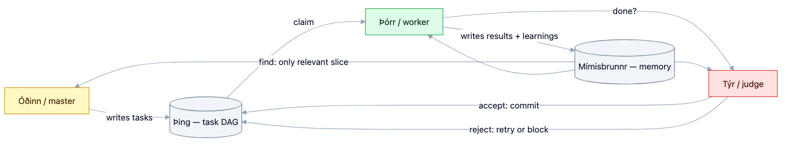
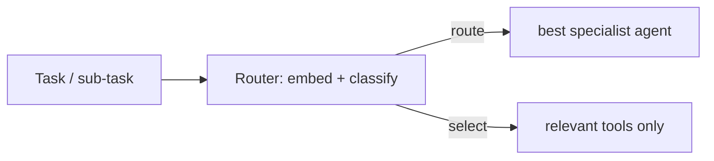

<!-- SPDX-License-Identifier: Apache-2.0 -->

# Basin — Orchestration (master / worker / judge)

> *Basin is the well of the Norns, where fate is decided. Artesian's orchestrator decides who
> does what, when, and whether the work is accepted.*

Orchestration is **opt-in** (`orchestrate`/`full` modes). If you only want memory, skip this — your
agent workflow is unchanged. When enabled, Artesian coordinates multiple agent invocations through a
**shared blackboard** (memory + task queue) rather than chatty direct messaging, which is the
token-efficient MAS pattern.

Status: **[implemented: core loop]** — Phase 2.5 ships the default blackboard loop: dispatch
eligible task-DAG nodes, run isolated workers, store worker learnings, gate through verifiers and
optional judge review, emit events/run-log token accounting, and transition to `done` only after
the judge gate passes. Debate/router/Contract-Net/pipeline remain config-selectable seams.

## Roles

| Role | Job | MAS pattern |
|---|---|---|
| `master` | plan, decompose, decide when to delegate, "listen" for results | manager |
| `worker` | execute one task; write code, not commits | worker |
| `judge` | review against gates (tests/lint); the **only** committer (`CompletedJob`) | critic / gatekeeper |

Roles are composable: master-judge only, one agent bound to all roles (e.g. Codex everywhere), or
the full triad. The master spends its tokens planning and **launches the worker so the worker's
tokens do the heavy lifting**, then the judge gates the result — an agentic loop with a quality
gate.

### Verifiers define the boundary of trust

The judge does not "vibe-accept" — it gates on **configurable verifiers**: concrete, deterministic
checks the work must pass before reaching `done`/commit (`CompletedJob`). Typical verifiers: test suite,
linter, type-check, build, format. Verifiers are declared in config; only when they pass is the
worker's output trusted enough to commit. This is what makes long-running autonomy safe: the
breadth of what an agent may do unattended is exactly the breadth your verifiers cover. Durable
**loops** (worker → verifier → judge → retry) turn this into self-correcting autonomy.

### Visual artifacts as control surfaces

Long-running agents are steered through **visual artifacts**, not transcripts: the task board
(headrace), the TUI (Gauge), an optional macOS tray (Tray), and the **OKF HTML visualizer** over
the memory bundle (see [memory.md](memory.md) §4.1). External mirrors (Jira/Linear) give the same
board in a familiar UI. These surfaces let a human glance, redirect, and approve without reading
raw logs.

## Coordination by shared blackboard (not chatter)

Agents do **not** stream long messages to each other (expensive, lossy). They coordinate
**indirectly** through shared state — the recommended token-efficient MAS topology:

[](diagrams/orchestrator-blackboard.mmd)

A **single mutation authority** serializes task-state changes (anti-race; from Symphony). The
blackboard is the task DAG (headrace) plus long-term memory (Aquifer); each agent reads only the
slice it needs via `memory.find`, never the whole history.

## Coordination & communication primitives

Even with blackboard coordination, the records exchanged need a defined shape. Artesian standardizes
a small **event envelope** (JSON, LLM-parseable) so any agent adapter and the observability layer
speak the same language — inspired by agent communication languages (FIPA ACL) but minimal:

```json
{
  "id": "evt-…", "correlation_id": "erindi-…", "timestamp": "2026-06-14T00:00:00Z",
  "sender": {"role": "master", "agent_id": "…"}, "protocol_version": "0.1",
  "type": "TASK_ANNOUNCED | TASK_CLAIMED | RESULT | VERDICT | BLOCKED | STATUS | ERROR",
  "payload": { }
}
```

`correlation_id` links a result/verdict back to its task (no need to replay history). Events are
represented by `artesian-core::EventEnvelope` and are intended for the blackboard (headrace/memory) and
run log.

**Coordination mechanisms** (the orchestrator is a centralized coordinator by default — simplest,
one authority):

- **Task allocation** — role bindings by default; optional capability routing via the
  [Router](#router--agent-routing-and-tool-selection-token-saver); an optional **Contract-Net**
  mode (announce → workers bid → award) for capability markets.
- **Synchronization** — the task DAG encodes dependencies; a **barrier** (a synthesis task) waits
  for all parallel sub-tasks before proceeding; claim/complete are events.
- **Resource management** — shared resources (model rate limits, API keys, DB connections) are
  governed by **quotas/scheduling**: per-agent/per-user token budgets and rate limits, connection
  pooling funneled through `artesiand` (see [concurrency.md](concurrency.md)).
- **Consensus (optional)** — debate/critique or simple voting among multiple critics when one
  judge is not enough.

**Worker workspace isolation (required for parallel workers on one project).** Each worker runs in
an **isolated workspace** (a git worktree or scratch directory) so concurrent workers on the same
repo do not clobber each other's files; results are integrated only through the judge gate. This is
the file-level complement to the memory concurrency model, and it composes with the optional
`sandbox` Docker sandbox.

**Observability.** Every event carries `id`/`correlation_id`/`timestamp`/`sender`; the orchestrator
emits structured run logs and per-agent/session token accounting, so multi-agent runs are
debuggable and the evaluator/judge has evidence to gate on.

## Topologies (config, hybrids allowed)

Artesian supports the standard collaborative architectures; pick per project, compose freely:

- **Hierarchical team** (default, core loop implemented) — task DAG → workers execute → judge gate
  accepts/retries/blocks. Master decomposition remains a seam before dispatch.
- **Debate / critique** — proposer + critic iterate to a quality bar (the judge loop generalized).
- **Router / dispatcher** — a router classifies a task and routes it to the best **specialist
  agent** (mixture-of-experts). See below.
- **Pipeline** — sequential stages, output→input.

## Runtime entrypoints

`artesian run` / `artesian orchestrate` runs the loop in the foreground. `artesiand` runs the same loop as
a daemon-style foreground process. Both are strictly gated to `orchestrate` or `full` mode; `memory`
mode returns without orchestration side effects. `--dry-run` uses mock agents and still exercises
task planning, dispatch, event emission, verifier gates, and memory writes without launching real
agent CLIs.

Process-backed agents are supervised. Each worker/judge subprocess is launched in its own process
group, recorded under `coordination.spawn_registry_path` (default `.artesian/spawns`), and terminated
as a whole group on success, timeout, cancellation, verifier rejection, quota exhaustion, SIGINT,
SIGTERM, or adapter drop. Shutdown is SIGTERM, `coordination.spawn_shutdown_grace_millis` of grace,
then SIGKILL. Startup reaps registry entries whose owning Artesian process is no longer alive, so a
crashed daemon does not leave orphaned agent trees behind.

Spawn ceilings are config-gated:

```toml
[coordination]
concurrency_limit = 2
max_concurrent_spawns = 32
spawn_max_lifetime_seconds = 1800
spawn_shutdown_grace_millis = 2000
spawn_registry_path = ".artesian/spawns"
```

`concurrency_limit` controls task dispatch. `max_concurrent_spawns` is the hard process cap enforced
by the process adapter; new subprocesses are refused once the cap is reached.
`spawn_max_lifetime_seconds` is a global per-spawn watchdog and is applied in addition to each agent
binding's `timeout_seconds`.

## Agent/model bindings

Each role binds to an agent CLI and may also bind to a concrete model:

```toml
[[agents]]
role = "master"
agent = "claude"
model = "claude-opus"
command = "claude"
args = ["--model", "{model}", "--print", "{prompt}"]

[[agents]]
role = "worker"
agent = "claude"
model = "claude-sonnet"
command = "claude"
args = ["--model", "{model}", "--print", "{prompt}"]

[[agents]]
role = "judge"
agent = "codex"
model = "gpt-5.5"
command = "codex"
args = ["exec", "--model", "{model}", "{prompt}"]
```

The same binary can therefore back multiple roles with different models. `{role}`, `{alias}`,
`{agent}`, `{model}`, and `{prompt}` are rendered by `artesian-process-agent` immediately before the
supervised subprocess launch. If `model` is set, Artesian validates it against the agent catalog
before spawning; unavailable models fail early and do not create a process-tree registry entry.

`artesian agents refresh` probes configured agents and writes the cached catalog to
`<memory.root>/agents.json`:

```json
{
  "generated_at": "1781540000000",
  "agents": [
    {
      "agent": "codex",
      "command": "codex",
      "reachable": true,
      "last_checked": "1781540000000",
      "models": [
        { "id": "gpt-5.5", "reachable": true, "source": "static-fallback" }
      ]
    }
  ]
}
```

If an entry is not reachable, `unreachable_reason` is one of `no-command`, `no-credentials`,
`quota`, `network`, or `unknown`. `last_checked` lets callers decide whether to refresh stale
catalog data.

Discovery order is: an optional agent-specific CLI list command (`ARTESIAN_<AGENT>_MODELS_CMD`),
provider-specific discovery hooks where credentials exist, curated static fallbacks for known
agents, and a cheap reachability probe for the configured command. Cache files are written with
restrictive permissions where the platform supports it.

## Credential handling contract

Artesian treats model/provider credentials as external runtime state:

- reuse the provider session or CLI credentials the operator already configured;
- do not collect or persist tokens unless the operator explicitly provides a storage path or
  secret manager;
- if a future adapter must persist a token, use restrictive file permissions (`0600`) and the OS
  keychain or platform secret store where available;
- never log provider credentials, environment variables, full command environments, or raw
  subprocess command lines;
- subprocess failure output is redacted and truncated before it appears in errors or run logs.

This contract applies to discovery, reachability probes, spawned role agents, and MCP delegation.

## MCP orchestration tools

When `artesian-mcp` is started from a config in `orchestrate` or `full` mode, it exposes orchestration
tools in addition to memory tools. In `memory` mode these routes are disabled and do not appear in
`tools/list`.

- `agents.list() -> { catalog }`
- `orchestrate.bind({ role, agent, model, command?, args?, timeout_seconds? }) -> { binding }`
- `orchestrate.delegate({ role, task }) -> { task_id, status, role, agent, model, result? }`
- `orchestrate.status({ task_id }) -> { task_id, status, result? }`
- `orchestrate.handoff({ to, task_id?, content }) -> { accepted, to }`

Delegation always uses the configured `ProcessAgent` path, so process-group cleanup, registry
reaping, spawn caps, per-spawn timeouts, and max-lifetime watchdogs are inherited from the normal
orchestration runtime.

`artesian init` writes a short master role prompt under the memory root. The prompt tells an
in-session master to call `agents.list`, recall with `memory.context`, delegate bounded subtasks via
`orchestrate.delegate(worker)`, and hand results through `orchestrate.handoff` before accepting
durable outcomes.

## Cheap/local coordinator pattern

The master/coordinator role can be bound to a cheap or local model, for example an Ollama small
model, because coordination can be mostly routing, queue management, and synthesis of already
retrieved context. This is an opt-in binding pattern, not a default recommendation: keep verifier
gates and judge roles strong enough for the project risk, and validate quality empirically before
standardizing on a cheap coordinator.

## Agent adapter provider guide

Adding a new agent such as OpenClaw or `pi` should not require core changes. Implement the
`Agent` trait: `spawn`, `send`, `stream`, `capabilities`, and `list_models`. Artesian supports two
integration modes:

- Artesian spawns the adapter as a role agent through supervised orchestration.
- The agent consumes Artesian's MCP memory/orchestration tools as a peer and keeps its own process
  lifecycle.

The default `ProcessAgent` adapter is enough for CLIs that accept prompt/model arguments. Native
adapters are only needed when a CLI has richer session semantics, streaming events, or model
discovery APIs that are worth exposing directly.

Provider authors should keep detection lean:

- check `PATH` and a small, documented set of known config directories such as `~/.codex`,
  `~/.claude`, or `~/.config/<agent>`;
- do not crawl home directories and do not read credential files during passive detection;
- implement `list_models` with the provider's own list-models command first, then an API query only
  when credentials are already present;
- return typed unreachable reasons instead of dumping provider errors;
- pass every spawn through the supervised `ProcessAgent` path unless the adapter implements an
  equivalent process-tree lifecycle guarantee.

## Router — agent routing and tool selection (token-saver)

Two routing problems, one embedding-backed mechanism (reuses Aquifer's embedder):

1. **Agent routing** — given a task, route it to the most suitable agent/role/specialist (e.g. a
   cheap OSS model for formatting, a frontier model for planning). Right-sizing the model per
   sub-task cuts cost.
2. **Semantic tool selection** — when an agent has many MCP tools, including every tool
  description in the prompt is wasteful. Artesian can return only the **relevant subset** for the
  current task (`tools.find`), materially cutting prompt tokens. This is opt-in
  (`coordination.router_enabled = true`) and directly serves Artesian's token-economy mission.



## Tasks are a DAG (parallelism + targeted retry)

Decomposition produces a **directed acyclic graph** of sub-tasks, not just a list: dependencies
are edges, independent sub-tasks run in **parallel workers**, and a failed sub-task is retried in
isolation without restarting the whole plan. Hierarchical decomposition refines compound tasks
into primitive (directly executable) ones. See [task-tracking.md](task-tracking.md).

## Cost discipline (MAS scales by tokens)

Many agents = communication/token overhead. Artesian's defaults keep it cheap: indirect blackboard
comms, `memory.find` slices instead of full-history replay, the master "listening" while the
worker spends, parallel independent sub-tasks, right-sized models per role, and embedding/result
caching. Orchestration never becomes the bottleneck the literature warns about.

## References

- Wooldridge, *An Introduction to MultiAgent Systems* (2nd ed., 2009) — MAS structures and
  coordination.
- Hong et al., *MetaGPT* (2023) — role-based agents, structured comms, SOPs.
  https://arxiv.org/abs/2308.00352
- Russell & Norvig, *AIMA* Ch. 11 (Planning) — Hierarchical Task Networks.
- Yao et al., *Tree of Thoughts* (NeurIPS 2023) — decomposition/search.
  https://arxiv.org/abs/2305.10601
- Patil et al., *Gorilla* (2023) — scaling tool invocation. https://arxiv.org/abs/2305.15334
- Wang et al., *A Survey on LLM-based Autonomous Agents* (2023). https://arxiv.org/abs/2308.11432
- Smith, *The Contract Net Protocol* (IEEE TC, 1980) — negotiated task allocation.
  https://doi.org/10.1109/TC.1980.1675516
- FIPA ACL (FIPA, 2002) — agent communication language / message acts (standard reference).
- Wu et al., *AutoGen* (2023) — multi-agent conversation/coordination patterns.
  https://arxiv.org/abs/2308.08155
- ApX, *Agentic LLM Systems & Memory Architectures*, Chapters 4–5 — planning, tools, MAS.
  https://apxml.com/courses/agentic-llm-memory-architectures
