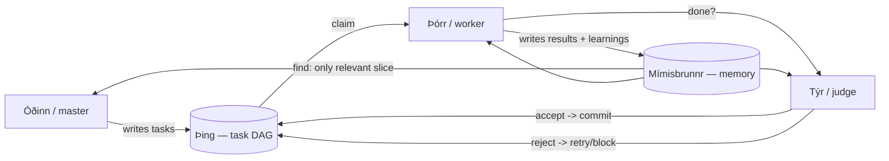
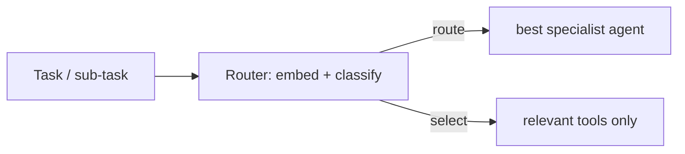

<!-- SPDX-License-Identifier: Apache-2.0 -->

# Urðarbrunnr — Orchestration (master / worker / judge)

> *Urðarbrunnr is the well of the Norns, where fate is decided. Brunnr's orchestrator decides who
> does what, when, and whether the work is accepted.*

Orchestration is **opt-in** (`orchestrate`/`full` modes). If you only want memory, skip this — your
agent workflow is unchanged. When enabled, Brunnr coordinates multiple agent invocations through a
**shared blackboard** (memory + task queue) rather than chatty direct messaging, which is the
token-efficient MAS pattern.

Status: **[planned]** — this is the design contract for the orchestrator phase.

## Roles

| Role (Norse / alias) | Job | MAS pattern |
|---|---|---|
| Óðinn / `master` | plan, decompose, decide when to delegate, "listen" for results | manager |
| Þórr / `worker` | execute one task; write code, not commits | worker |
| Týr / `judge` | review against gates (tests/lint); the **only** committer (Galdr) | critic / gatekeeper |

Roles are composable: master-judge only, one agent bound to all roles (e.g. Codex everywhere), or
the full triad. The master spends its tokens planning and **launches the worker so the worker's
tokens do the heavy lifting**, then the judge gates the result — an agentic loop with a quality
gate.

## Coordination by shared blackboard (not chatter)

Agents do **not** stream long messages to each other (expensive, lossy). They coordinate
**indirectly** through shared state — the recommended token-efficient MAS topology:

A **single mutation authority** serializes task-state changes (anti-race; from Symphony). The
blackboard is the task DAG (Þing) plus long-term memory (Mímisbrunnr); each agent reads only the
slice it needs via `memory.find`, never the whole history.

## Topologies (config, hybrids allowed)

Brunnr supports the standard collaborative architectures; pick per project, compose freely:

- **Hierarchical team** (default) — master decomposes → workers execute → master/judge synthesize.
- **Debate / critique** — proposer + critic iterate to a quality bar (the judge loop generalized).
- **Router / dispatcher** — a router classifies a task and routes it to the best **specialist
  agent** (mixture-of-experts). See below.
- **Pipeline** — sequential stages, output→input.

## Router — agent routing and tool selection (token-saver)

Two routing problems, one embedding-backed mechanism (reuses Mímisbrunnr's embedder):

1. **Agent routing** — given a task, route it to the most suitable agent/role/specialist (e.g. a
   cheap OSS model for formatting, a frontier model for planning). Right-sizing the model per
   sub-task cuts cost.
2. **Semantic tool selection** — when an agent has many MCP tools, including every tool
   description in the prompt is wasteful. Brunnr can embed tool descriptions and return only the
   **relevant subset** for the current task (`tools.find`), materially cutting prompt tokens. This
   is opt-in and directly serves Brunnr's token-economy mission.

## Tasks are a DAG (parallelism + targeted retry)

Decomposition produces a **directed acyclic graph** of sub-tasks, not just a list: dependencies
are edges, independent sub-tasks run in **parallel workers**, and a failed sub-task is retried in
isolation without restarting the whole plan. Hierarchical decomposition refines compound tasks
into primitive (directly executable) ones. See [task-tracking.md](task-tracking.md).

## Cost discipline (MAS scales by tokens)

Many agents = communication/token overhead. Brunnr's defaults keep it cheap: indirect blackboard
comms, `memory.find` slices instead of full-history replay, the master "listening" while the
worker spends, parallel independent sub-tasks, right-sized models per role, and embedding/result
caching. Orchestration never becomes the bottleneck the literature warns about.

## References

- Wooldridge, *An Introduction to MultiAgent Systems* (2nd ed., 2009) — MAS structures and
  coordination.
- Hong et al., *MetaGPT* (2023) — role-based agents, structured comms, SOPs.
  https://arxiv.org/abs/2308.00352
- Russell & Norvig, *AIMA* Ch. 11 (Planning) — Hierarchical Task Networks.
- Yao et al., *Tree of Thoughts* (NeurIPS 2023) — decomposition/search.
  https://arxiv.org/abs/2305.10601
- Patil et al., *Gorilla* (2023) — scaling tool invocation. https://arxiv.org/abs/2305.15334
- Wang et al., *A Survey on LLM-based Autonomous Agents* (2023). https://arxiv.org/abs/2308.11432
- ApX, *Agentic LLM Systems & Memory Architectures*, Chapters 4–5 — planning, tools, MAS.
  https://apxml.com/courses/agentic-llm-memory-architectures
