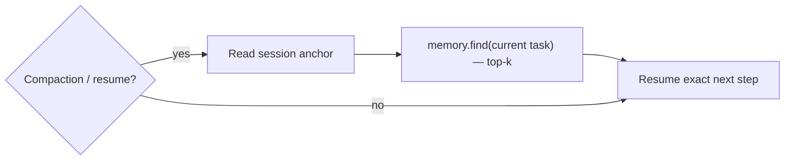

<!-- SPDX-License-Identifier: Apache-2.0 -->

# Self-Repair Across Auto-Compaction

Long agent sessions hit context auto-compaction: the host summarizes or truncates the context and
the agent can lose its place. Artesian makes this a non-event by combining a deterministic anchor
with targeted recall, so even switching agents mid-task (e.g. Claude Code → Codex) is lossless.

Three mechanisms:

1. **Session anchor (Anchor)** — a tiny, always-current record of the in-flight task, the active
   plan pointer, the last N decisions, and the next concrete step. Cheap to update every turn.
2. **Continuous externalization** — durable learnings are written to long-term memory as they
   occur, so truncation loses nothing recoverable via `memory.find`.
3. **Self-repair hook** — on a detected compaction/resume boundary the agent re-reads the anchor
   (deterministic — answers "what is my current step") and runs a targeted `memory.find`
   (semantic — restores surrounding knowledge) before its next action. No manual "re-read the
   docs" step.

Status: `AnchorAnchorStore` writes and reads the anchor in OKF `log.md`; MCP exposes
`memory.anchor.get` / `memory.anchor.set`; the CLI exposes `artesian memory anchor get|set|recover`.
The host-specific compaction detector remains an integration concern, but the replay primitive is
implemented and tested.
