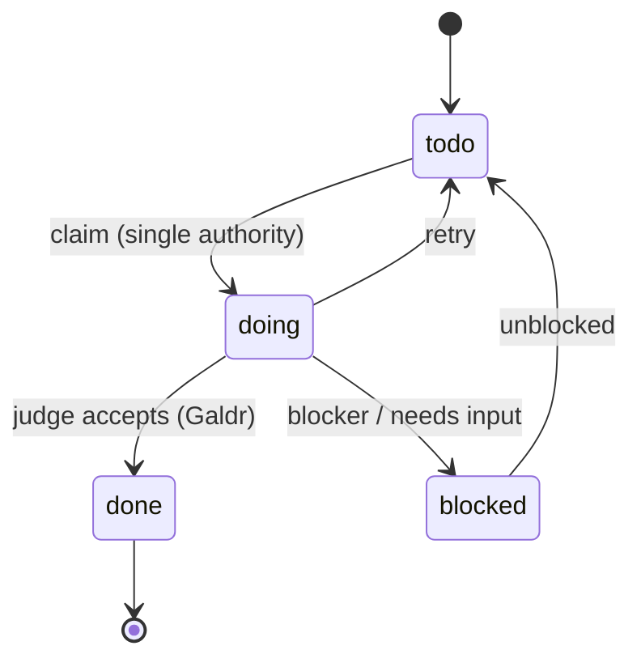
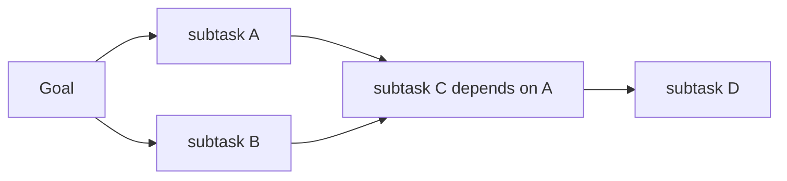
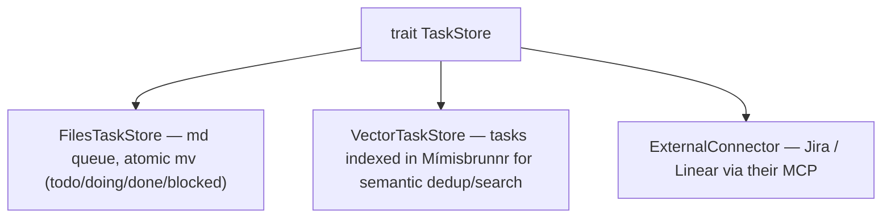
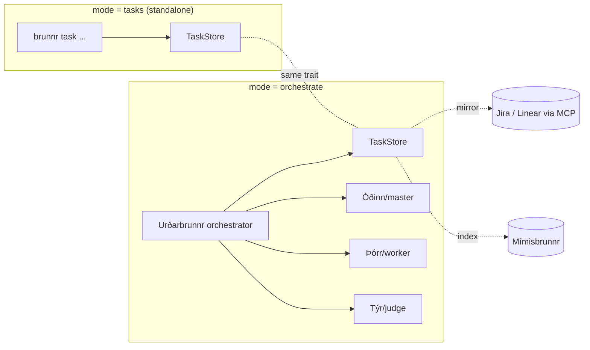

<!-- SPDX-License-Identifier: Apache-2.0 -->

# Þing — Brunnr Task Tracking

> *Þing was the Norse assembly where matters were decided. Brunnr's task tracker is where work
> items are filed, claimed, and resolved.*

Task tracking is a first-class Brunnr component, not just an orchestrator internal. It is usable
**standalone** (mode `tasks`) by developers who only want a fast, agent-friendly task queue, and
the orchestrator (Urðarbrunnr) consumes it **under the hood** when running master/worker/judge.

Status: the `TaskStore`, `FilesTaskStore`, `VectorTaskStore`, verifier gate, external connector
seam, and `brunnr task` CLI are implemented in `crates/thingr` and `brunnr-cli`. The full
orchestrator loop remains future work.

---

## 1. Goals

- A race-safe task queue an agent (or a human) can drive without a server.
- Storage parity with memory: works with **markdown task files** *and* a **vector DB**, behind
  one trait — same dual-backend philosophy as Mímisbrunnr.
- Optional **external connectors** (Jira, Linear) via their MCP servers, so tasks also "land" in
  the tracker the team already uses and are visible in a familiar UI.
- Reuse the proven `.agent/`-style md queue (atomic `mv` between state directories) that already
  works in practice.

## 2. Model

A task is an `Erindi` (already a core type). It carries: `id`, `title`, `priority`, `state`,
`body` (md), `tags`, `blockers`, `created_at`, `updated_at`, and optional `external_ref`
(e.g. a Linear/Jira issue id). States form the queue (`Þing`):



`Galdr` (a completed task) is reached only through the judge gate in orchestrate mode; in
standalone `tasks` mode the human moves the task. A **single mutation authority** serializes
state transitions (the orchestrator, or the CLI lock) to prevent duplicate claims — the
anti-race lesson from Symphony.

### Tasks form a DAG (dependencies → parallelism + targeted retry)

`Erindi.blockers` are edges: tasks form a **directed acyclic graph**, not a flat list. This lets
independent sub-tasks run in **parallel workers**, encodes prerequisites explicitly, and isolates
a failed sub-task for retry without restarting the plan. Decomposition (by the planner/master)
refines **compound** tasks into **primitive** (directly executable) ones — a Hierarchical Task
Network style — emitting the DAG.



A task is dispatch-eligible only when all its blockers are terminal — the standard DAG-ready rule.
References: Russell & Norvig, *AIMA* Ch. 11 (HTN); linear-vs-DAG task representation.

## 3. Storage seam — `TaskStore`

Mirror the memory design exactly: a thin trait with interchangeable backends.



`TaskStore` operations: `create`, `claim`, `transition`, `get`, `list(filter)`, `find(query)`.

- **`FilesTaskStore`** — the default, zero-infra: tasks are md files under
  `<root>/tasks/{todo,doing,done,blocked}/`, transitions are atomic `mv` (race-safe), `list` is a
  directory scan. This is the well-known `.agent/`-style filesystem task-queue pattern.
- **`VectorTaskStore`** — indexes each task's title+body into a Mímisbrunnr collection so the
  agent can `find` semantically similar prior tasks (dedup, "have we solved this before?") and so
  task search shares the memory retrieval stack (RRF, tiers). Can wrap `FilesTaskStore` as the
  source of truth and keep the vector index as a derived view.
- **`ExternalConnector`** — bridges to Jira/Linear through their MCP servers. Tasks created in
  Brunnr are mirrored to the external tracker (and optionally pulled back), giving teams a visual
  board while the agent works the local queue. The connector is opt-in and never required for the
  local modes.

## 4. How the pieces compose



Standalone users get a useful queue with one binary; orchestrate users get the same queue driven
by the agent loop, with the judge as the sole gate to `done`. Because `TaskStore` is one trait,
md-only teams, vector-indexed teams, and Jira/Linear teams all use the same commands.

## 5. CLI

```bash
brunnr task add "Refactor vector layer" --blocker task-123
brunnr task list
brunnr task claim <id>            # todo -> doing (single authority)
brunnr task done <id>             # verifier gate, then doing -> done
brunnr task find "vector backend" # semantic search over tasks (VectorTaskStore)
```

## 6. Decisions

- Task tracking is a **separate component** (`crates/thingr`) so it can be used on its
  own, and is **composed** by the orchestrator rather than duplicated inside it.
- Storage parity with memory via a `TaskStore` trait; `FilesTaskStore` is the zero-infra default;
  `VectorTaskStore` reuses Mímisbrunnr; external trackers are connectors, never a hard dependency.
- Single mutation authority + atomic `mv` keep the queue race-free without a database.
